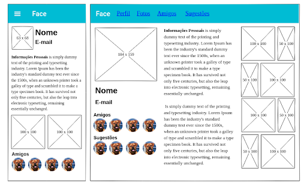

# Tarefa 14 | Página Responsiva Meu Perfil

Implemente uma página simples apresentando o seu perfil.

Nesta página você deve apresentar:

1. uma imagem que te identifique;
2. um texto com informações sobre você;
3. imagens que representem você nos seus hobbies;
4. uma lista de imagens que identifique os seus amigos.

Esta página deve ser responsiva, de modo que, quando o usuário estiver em um dispositivo maior, o layout deve ser reorganizado para apresentar os dados de uma melhor forma - podendo até apresentar mais informações.

Esta página deve ter um menu com, no mínimo, 4 itens, que também é responsivo. Em caso de não haver espaço suficiente, o menu deve funcionar em modo expande - colapsa.

Veja um protótipo de exemplo:

- Não implemente códigos CSS no arquivo HTML.
- O menu não precisa estar funcional.
- Implemente estilos diferentes para o esquema de cores light e dark.
- Pense mobile-first!
